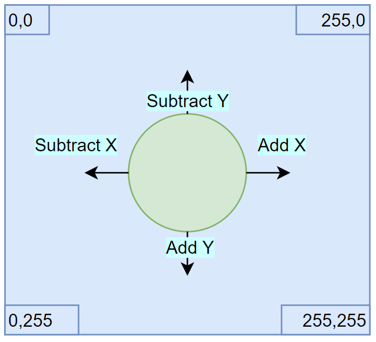

- title : Mucking About In MonoGame
- description : Lightning talk on using F# with MonoGame
- author : Luke Merrett
- theme : night
- transition : default

***

### What is MonoGame?


* Open Source implementation of Microsoft's XNA Framework
* XNA was made to build Xbox 360 and Windows games in .Net
* Formed the basis of indie game development on Xbox 360

---

## Cross Platform Support

MonoGame allows cross-platform game development, targeting:

|-|-|-|
|Windows|Linux|MacOs|
|iOs|Android| |
|PS4|PS Vita| |
|Xbox One|Nintendo Switch| |

---

## Popular XNA Games


***

## Aim For Today

Show a basic game using the MonoGame Framework with F#

Including:

* Implementing the core game loop (load, update, draw)
* Rendering an image to the screen
* Taking user input
* Translating that into movement

***

## Stage 1: Bootstrapping

1. In VS 2017 create a new F# Project (F# 4.1, .Net Framework 4.6.1)
2. Install NuGet package `MonoGame.Framework.WindowsDX`
3. Open `Program.cs`, we'll be adding all code in there

---

Import these namespaces:

```fsharp
open Microsoft.Xna.Framework
open Microsoft.Xna.Framework.Graphics
open Microsoft.Xna.Framework.Input
```

---

We'll create the basic game class, containing the core game loop:

```fsharp
type SampleGame () as g =
    // Game is an XNA class that abstracts the common game loop away.
    inherit Game() 

    // Responsible for initialising & controlling the presentation of the graphics
    // Here we'll just use it to work out the resolution of the player's window
    let _graphics = new GraphicsDeviceManager(g)

    // SpriteBatch controls what is drawn to the screen
    // We'll use this later to show our image
    let mutable _spriteBatch = Unchecked.defaultof<SpriteBatch>
```

---

`LoadContent` is responsible for reading images, audio etc before the game starts

```fsharp
    override g.LoadContent() =
        _spriteBatch <- new SpriteBatch(g.GraphicsDevice)
```

---

`Update` is responsible for modifying any game state

For example if the player has pressed a key

Or if we need to change the position / speed of a character.

```fsharp
    override g.Update(gameTime) =
        // Stop the game if the player presses escape
        if Keyboard.GetState().IsKeyDown(Keys.Escape) then g.Exit();
```

---

`Draw` is responsible for outputting any images to the screen

```fsharp
    override g.Draw(gameTime) = 
        // Clear the screen with a lovely cornflower blue
        g.GraphicsDevice.Clear(Color.CornflowerBlue);

        _spriteBatch.Begin();
        // Draw sprites here
        _spriteBatch.End();
```

---

Initialise and run the game:

```fsharp
[<EntryPoint>]
let main argv = 
    use game = new SampleGame()
    game.Run()
    0
```

***

## Stage 2: Displaying Our Image

This is our character: 


We need to add it to our project under `Content/logo.png` and set it to copy to our build directory.

---

We'll add a new field to store the logo in the `SampleGame` class:

```fsharp
let mutable _logo = Unchecked.defaultof<Texture2D>
```

---

Under the `LoadContent` method, load the image into memory:

```fsharp
use file = new FileStream("Content/logo.png", FileMode.Open)
_logo <- Texture2D.FromStream(g.GraphicsDevice, file)
```

---

Under the `Draw` method, render the image:

```fsharp
_spriteBatch.Draw(_logo, new Vector2(0.0f, 0.0f), Color.White)
```

Run the program to show our sprite.

***

## Stage 3: Build Sprite Record

We want to be able to move our image around, so it makes sense to store both the image and it's position in the same type.

We also want our image to have a speed, determining how fast it will move.

---

Add this type to the module before `SampleGame` is declared:

```fsharp
type Sprite = { texture: Texture2D; position: Vector2; speed: float32 }
```

---

Inside `SampleGame` add a new private method to abstract our loading logic:

```fsharp
member private g.LoadImage(name) = 
    use file = new FileStream(name, FileMode.Open)
    Texture2D.FromStream(g.GraphicsDevice, file)
```

---

Update our `_logo` field to:

```fsharp
let mutable _logo = Unchecked.defaultof<Sprite>
```

---

Update `LoadContent` so `_logo` is set with:

```fsharp
_logo <- {
    texture = g.LoadImage("Content/logo.png")
    position = Vector2(0.0f, 0.0f)
    speed = 300.0f
}
```

---

Finally we'll update `Draw` to use the new vector property:

```fsharp
_spriteBatch.Draw(_logo.texture, _logo.position, Color.White)
```

***

## Stage 4: Add Movement

Our image isn't particularly interesting yet, so let's allow our player to move it around.

---

Movement == Changing the vector / position of the image



---

Let's extend our domain to cover the types of movement we're interested in.

```fsharp
type Adjustment = Add | Subtract
type Dimension = X | Y
type Movement = Keys * Adjustment * Dimension

let possibleMoves : Movement list = [
    Keys.Up, Subtract, Y
    Keys.Down, Add, Y
    Keys.Left, Subtract, X
    Keys.Right, Add, X
]
```

---

We now need a way of translating a key press into a movement of the images position.

```fsharp
let Move (gameTime: GameTime)
         (sprite: Sprite) 
         (kstate: KeyboardState): Sprite =
    possibleMoves
    |> List.fold(fun (position: Vector2) (key, adjustment, dimension) -> 
        // Starting with our current position
        // Take every possible move and apply it to our position
        // -- Actual logic in next slide -- 
        position  
    ) sprite.position
    // Apply the updated position to the sprite
    |> fun updatedPosition -> { sprite with position=updatedPosition }
```

---

Our fold function is:

```fsharp
        if kstate.IsKeyDown(key) 
        then 
             let elapsedTime = (gameTime.ElapsedGameTime.TotalSeconds |> float32)
             let amountMoved = sprite.speed * elapsedTime
             match (adjustment, dimension) with
             | (Add, Y) -> Vector2(position.X, position.Y + amountMoved )
             | (Subtract, Y) -> Vector2(position.X, position.Y - amountMoved )
             | (Add, X) -> Vector2(position.X + amountMoved, position.Y)
             | (Subtract, X) -> Vector2(position.X - amountMoved, position.Y)
        else position
```

---

Change the `Update` function so logo is set as:

```fsharp
_logo <- Move gameTime _logo (Keyboard.GetState())
```

Run the game again

***

## Stage 5: Stop at Borders

We need to modify our logic so if the player hits the borders, the image stops

---

Add a new function above `Move`:

```fsharp
let StopAtBorders (graphics: GraphicsDeviceManager) (sprite: Sprite): Sprite = 
    let maxWidth = 
        graphics.PreferredBackBufferWidth - sprite.texture.Width |> float32 
    let maxHeight = 
        graphics.PreferredBackBufferHeight - sprite.texture.Height |> float32

    let x = Math.Min(Math.Max(0.0f, sprite.position.X), maxWidth);
    let y= Math.Min(Math.Max(0.0f, sprite.position.Y), maxHeight);

    {sprite with position = Vector2(x, y)}
```

---

Update the `Move` function to take a new parameter: 

```fsharp
let Move (gameTime: GameTime) 
         (sprite: Sprite) 
         (kstate: KeyboardState) 
         (graphics: GraphicsDeviceManager): Sprite =
```

---

In the `Move` function add this last pipe forward operator:

```fsharp
|> StopAtBorders graphics
```

Run the game again

***

## Next Steps

MonoGame has extensive docs & templates here: 
http://www.monogame.net/

These slides are available at:
https://fsharpbristol.github.io/FSharpBristol/presentations