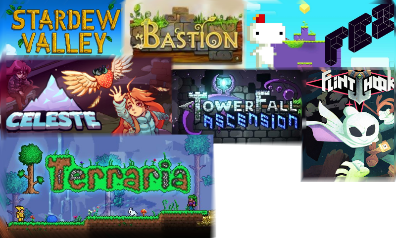

- title : Mucking About In MonoGame
- description : Lightning talk on using F# with MonoGame
- author : Luke Merrett
- theme : night
- transition : default

***

### What is MonoGame?


* Open Source implementation of Microsoft's XNA Framework
* XNA was made to build Xbox 360 and Windows games in .Net
* Formed the basis of indie game development on Xbox 360

---

## Cross Platform Support

MonoGame allows cross-platform game development, targeting:

|-|-|-|
|Windows|Linux|MacOs|
|iOs|Android| |
|PS4|PS Vita| |
|Xbox One|Nintendo Switch| |

---

## Popular XNA Games



***

## Aim For Today

Show a basic game using the MonoGame Framework with F#

Including:

* Implementing the core game loop (load, update, draw)
* Rendering an image to the screen
* Taking user input
* Translating that into movement

***

## Stage 1:  Bootstrapping

1. In VS 2017 create a new F# Project (F# 4.1, .Net Framework 4.6.1)
2. Install NuGet package `MonoGame.Framework.WindowsDX`
3. Open `Program.cs`, we'll be adding all code in there

---

Import these namespaces:

```fsharp
open Microsoft.Xna.Framework
open Microsoft.Xna.Framework.Graphics
open Microsoft.Xna.Framework.Input
```

---

We'll create the basic game class, containing the core game loop:

```fsharp
type SampleGame () as g =
    // Game is an XNA class that abstracts the common game loop away.
    inherit Game() 

    // Responsible for initialising & controlling the presentation of the graphics
    // Here we'll just use it to work out the resolution of the player's window
    let _graphics = new GraphicsDeviceManager(g)

    // SpriteBatch controls what is drawn to the screen
    // We'll use this later to show our image
    let mutable _spriteBatch = Unchecked.defaultof<SpriteBatch>
```

---

`LoadContent` is responsible for reading images, audio etc before the game starts

```fsharp
    override g.LoadContent() =
        _spriteBatch <- new SpriteBatch(g.GraphicsDevice)
```

---

`Update` is responsible for modifying any game state

For example if the player has pressed a key

Or if we need to change the position / speed of a character.

```fsharp
    override g.Update(gameTime) =
        // Stop the game if the player presses escape
        if Keyboard.GetState().IsKeyDown(Keys.Escape) then g.Exit();
```

---

`Draw` is responsible for outputting any images to the screen

```fsharp
    override g.Draw(gameTime) = 
        // Clear the screen with a lovely cornflower blue
        g.GraphicsDevice.Clear(Color.CornflowerBlue);

        _spriteBatch.Begin();
        // Draw sprites here
        _spriteBatch.End();
```

---

Initialise and run the game:

```fsharp
[<EntryPoint>]
let main argv = 
    use game = new SampleGame()
    game.Run()
    0
```